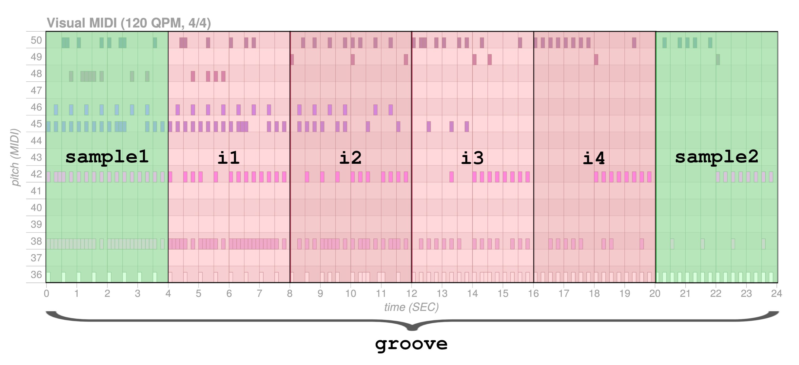

## Score transformation with MusicVAE and GrooVAE
- **Sample**: Sample two different scores of two bars each. (using `cat-drums_2bar_small` and `cat-mel_2bars_big` configuration)
- **Interpolate**: Interpolate between the two generated scores. What interpolation 
means is that it will progressively change the scores, going from the first sample to the second one. (using same configuration with above)
- **Groove**: Humanize the previous 16-bars sequence by adding groove. (using `groove_2bar_humanize` configuration)

